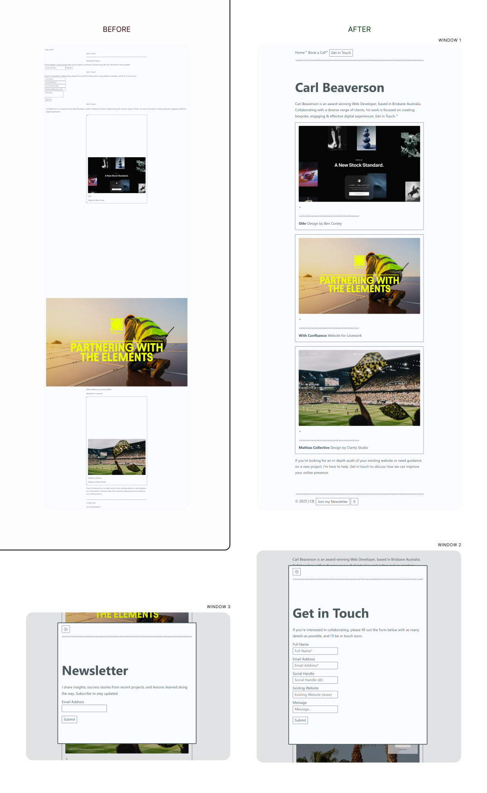
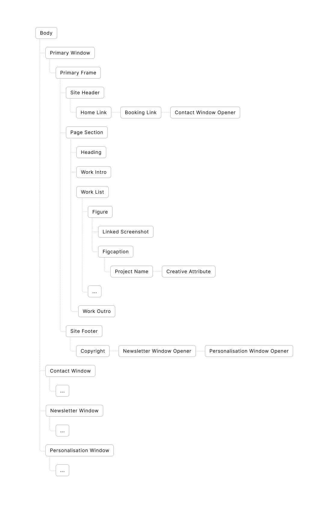
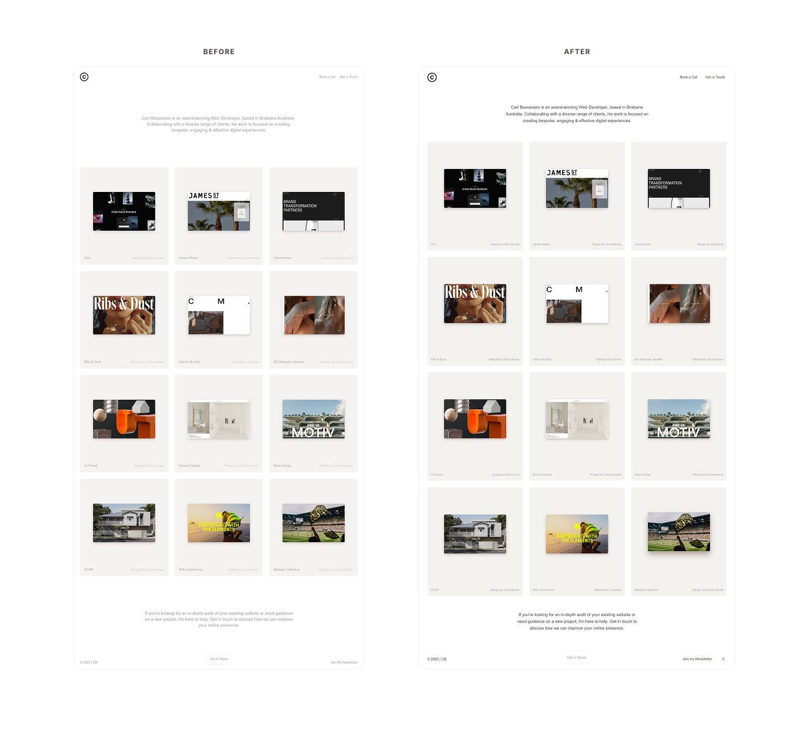
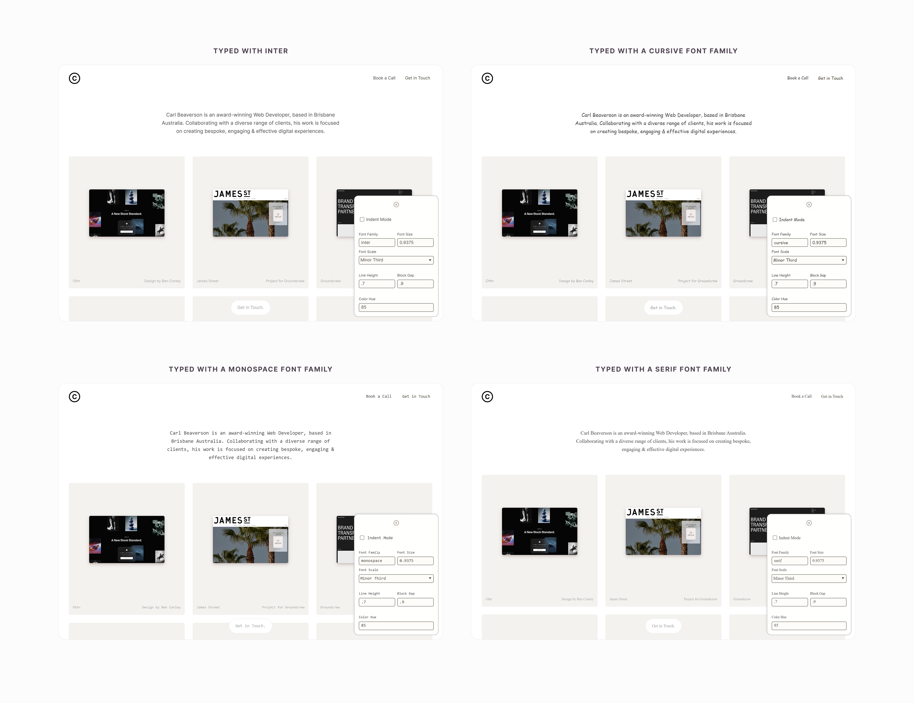
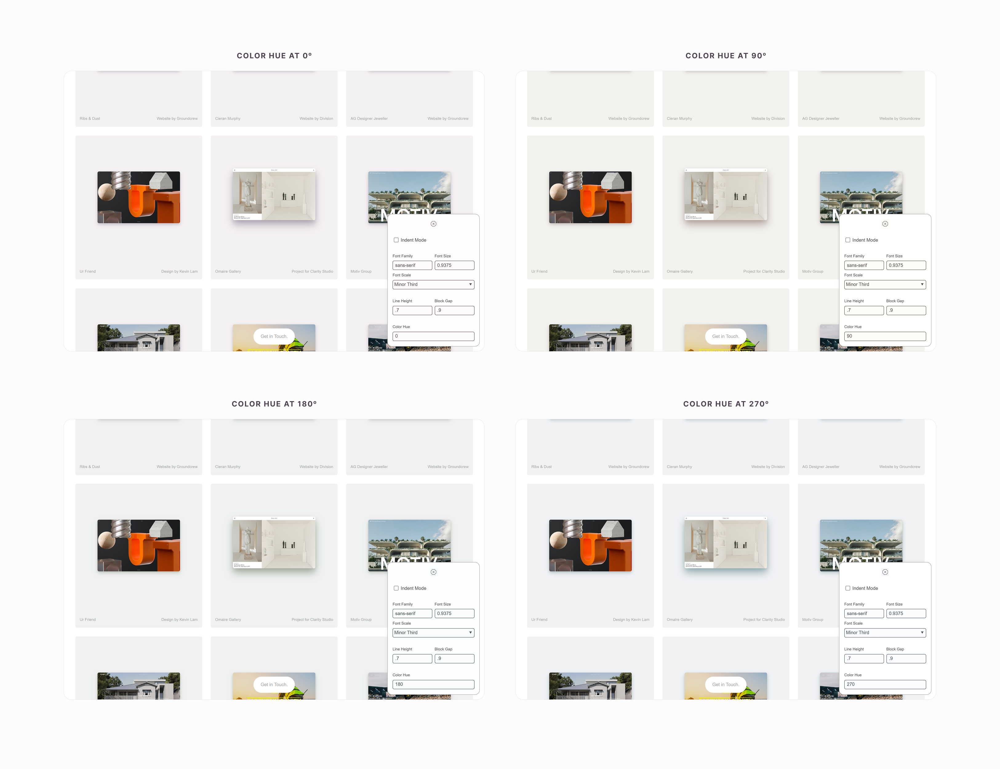
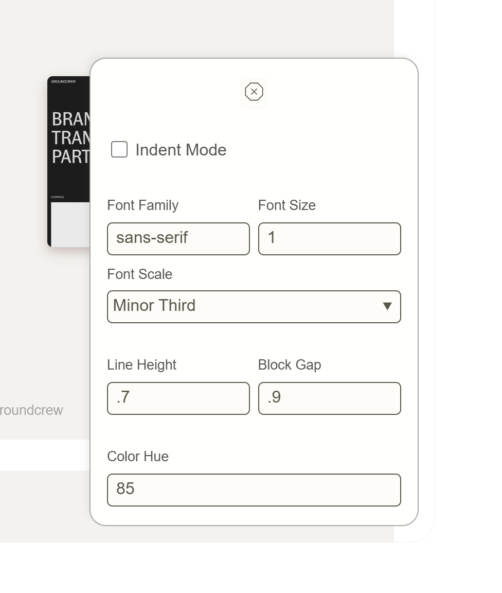

I saw Carl Beaverson's [post on X](https://x.com/ToheebDotCom/status/1921981966519332952) looking for Web Developers — Nice. Let me kill 2 birds with one stone. Let me test Base CSS on his minimalistic website and shoot a shot at the gig.

## Better Document Structure

4 main actions improved the document structure. 

- Putting contents in their respective window. 

  The primary window showcases the works, while the 2 secondary windows presents the contact and subscribe windows respectively.

- Provision of an heading for contents in the main frame of the window.

- Removal of 2 extraneous visual components for each work presentation.

  These components were hacks to improve performance but they should have been hidden untill needed.

- Mark each work presentation as a self-contained component that it is. Then, specify the link on the image itself.

Here is an excerpt for the document tree: 

## Personalisable Design

There's more to using an harmonius system for scaling visual elements. 

Users can now personalise the design in many ways

- Use any typeface: 

- Use any color hue in the light mode that the original design supports. 

And more via the Personalisation Window. Be it to bump and scale sizes or manage line and block spaces. 
